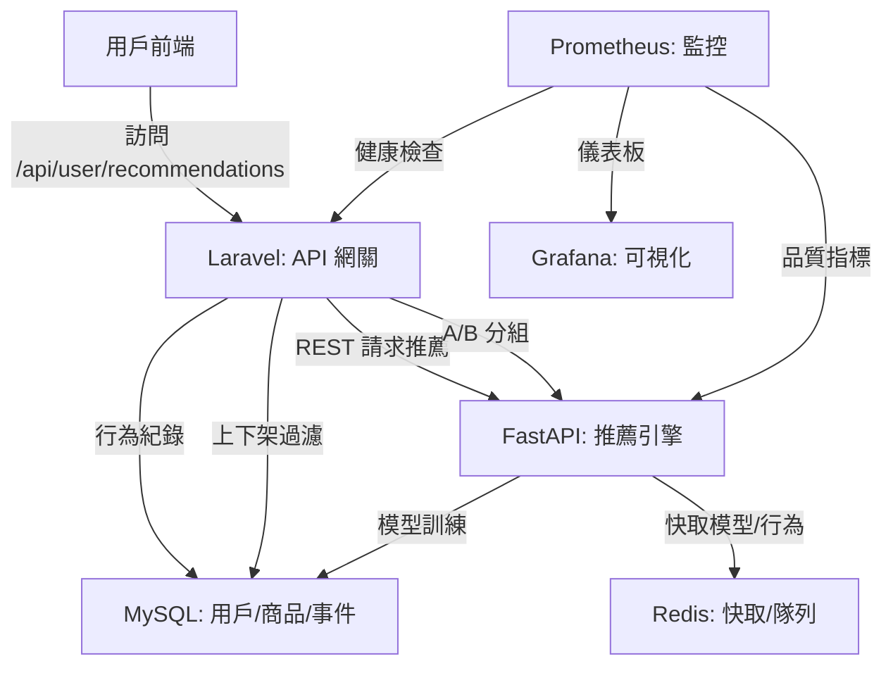

# 推薦系統專案

這是一個技術導向的推薦系統專案，採用跨語言微服務架構，結合 Laravel 和 FastAPI，透過 Docker 環境實現個性化商品推薦、A/B 測試、商品上下架管理與即時監控。以下說明專案的功能、架構、核心實現與擴充性。

## 專案概述
**功能**：
- **個性化推薦**：透過 Laravel 的 `/api/user/recommendations` 路由，從 FastAPI 獲取推薦結果，過濾上架商品後回傳前端。
- **A/B 測試**：動態分組（Thompson Sampling）比較推薦策略，提升點擊率與轉化率。
- **商品管理**：管理商品資訊與上下架狀態，確保推薦符合業務需求。
- **行為追蹤**：記錄用戶曝光與點擊行為，支援模型訓練與效果分析。
- **即時監控**：監控系統性能（延遲、錯誤率）與推薦品質（冷啟動比例、重複率、多樣性、覆蓋率、熵值）。

**技術亮點**：
- **微服務解耦**：Laravel 處理 API 網關與業務邏輯，FastAPI 專注推薦推論與模型訓練。
- **高效快取**：Redis 儲存模型、行為與推薦結果，支援重複率計算與隊列。
- **自動化訓練**：APScheduler 每 6 小時更新模型，確保推薦即時性。
- **可觀測性**：Prometheus 與 Grafana 提供全面指標監控與告警。

**目的**：
- 提供精準的個性化推薦，優化用戶體驗與業務指標。
- 透過 A/B 測試持續改進推薦策略，支援 Retail Media Network、內容推薦等場景。
- 確保系統穩定性與高可維護性，快速響應問題。

**核心流程**：
1. 用戶訪問 `/api/user/recommendations`，Laravel 進行 A/B 分組與認證。
2. Laravel 請求 FastAPI，傳遞用戶 ID 與策略版本。
3. FastAPI 使用協同過濾生成推薦（僅上架商品），回傳商品 ID。
4. Laravel 透過 `Product::active()` 二次過濾，回傳前端。
5. 用戶行為記錄至 MySQL，供 FastAPI 訓練與監控分析。

## 系統架構
以下是架構圖，展示模組互動與功能：



- **Laravel**：API 網關，負責 `/api/user/recommendations`、A/B 分組、行為紀錄與上下架過濾。
- **FastAPI**：推薦引擎，執行協同過濾與模型訓練，定時同步商品資料。
- **MySQL**：儲存用戶、商品（含 `status`）與行為事件（`recommendation_events`）。
- **Redis**：快取模型、行為與推薦結果，支援重複率計算與隊列。
- **Prometheus & Grafana**：監控系統與推薦品質，提供告警與可視化。
- **Docker Compose**：統一容器管理，確保環境一致。

## 環境需求
- Docker & Docker Compose
- PHP 8.2（Laravel）
- Python 3.9（FastAPI）
- Composer（Laravel 依賴）
- pip（Python 依賴）

## 專案結構
```
recommendation-system/
├── laravel-app/                # Laravel 應用
│   ├── app/                   # 邏輯（中間件、服務、模型）
│   ├── config/                # 設定（A/B 測試）
│   ├── database/              # 遷移與填充
│   ├── docker/                # Nginx/Supervisor
│   ├── resources/views/       # Blade 模板
│   └── routes/                # API/Web 路由
├── ai-recommender-service/     # FastAPI 服務
│   ├── model/                 # 模型儲存
│   ├── main.py                # FastAPI 主程式
│   ├── recommender.py         # 推薦邏輯
│   └── requirements.txt       # Python 依賴
├── prometheus/                # Prometheus 設定
├── grafana/                   # Grafana 設定
├── .env                       # 環境變數
└── docker-compose.yml         # 容器編排
```

## 啟動步驟
1. **確認環境變數**：
   - 檢查 `.env`，包含：
     ```env
     APP_KEY=
     DB_HOST=mysql
     DB_DATABASE=laravel
     DB_USERNAME=laravel_user
     DB_PASSWORD=laravel_password
     REDIS_HOST=redis
     RECOMMENDATION_API_URL=http://fastapi-recommender:8000
     RECOMMENDATION_AB_TEST_SALT=some_random_salt
     ```
   - 若無 `.env`，複製 `laravel-app/.env.example`：
     ```bash
     cp laravel-app/.env.example .env
     ```

2. **啟動 Docker**：
   ```bash
   docker compose up --build -d
   ```

3. **安裝 Laravel 依賴**：
   ```bash
   docker compose exec laravel-app composer install
   ```

4. **生成 APP_KEY**：
   ```bash
   docker compose exec laravel-app php artisan key:generate --show
   ```
   將輸出複製到 `.env` 的 `APP_KEY=`。

5. **執行遷移**：
   ```bash
   docker compose exec laravel-app php artisan migrate
   ```

6. **填充資料**：
   ```bash
   docker compose exec laravel-app php artisan db:seed --class=ProductSeeder
   ```

7. **綁定事件**：
   編輯 `laravel-app/app/Providers/EventServiceProvider.php`：
   ```php
   protected $listen = [
       'App\Events\RecommendationInteraction' => [
           'App\Listeners\LogRecommendationInteraction',
       ],
   ];
   ```

8. **安裝 FastAPI 依賴**：
   ```bash
   docker compose exec fastapi-recommender pip install -r requirements.txt
   ```

## 使用方式
- **推薦 API**：`http://localhost:8000/api/user/recommendations`
  - 先訪問 `http://localhost:8000/login-test/1` 模擬登入（用戶 ID 1）。
- **商品列表**：`http://localhost:8000/products`（Blade 模板）。
- **追蹤點擊**：POST `http://localhost:8000/api/track/click`：
  ```json
  {
      "product_id": 1,
      "group": "control",
      "experiment_name": "default_recommendation_experiment"
  }
  ```
- **FastAPI 健康檢查**：`http://localhost:8001/health`
- **監控**：
  - Prometheus：`http://localhost:9090`
  - Grafana：`http://localhost:3000`（帳密：`admin/admin`）

## 關鍵代碼解析
### 1. Laravel 中間件：A/B 分組
檔案：`laravel-app/app/Http/Middleware/AssignRecommendationGroup.php`
```php
public function handle(Request $request, Closure $next)
{
    $userId = Auth::id();
    $experimentName = 'default_recommendation_experiment';
    $experimentConfig = config('ab_test.experiments.' . $experimentName);

    if (!isset($experimentConfig['enabled']) || !$experimentConfig['enabled']) {
        $assignedGroup = $experimentConfig['default_group'] ?? 'control';
    } else {
        if (!$userId) {
            $guestId = session()->getId();
            $assignedGroup = $this->assignGroupWithWeight($guestId, $experimentConfig['groups'], config('ab_test.salt'));
            session(['recommendation_group' => $assignedGroup]);
            $userId = 0;
        } else {
            $user = Auth::user();
            $assignedGroup = $user->recommendation_group ?: $this->assignGroupWithThompsonSampling($userId, $experimentName, $experimentConfig['groups']);
            $user->recommendation_group = $assignedGroup;
            $user->save();
        }
    }

    $request->attributes->set('recommendation_group', $assignedGroup);
    $request->attributes->set('current_user_id', $userId);
    return $next($request);
}
```
**解析**：動態分配 A/B 分組，支援 Thompson Sampling（已登入用戶）與加權隨機（訪客）。

### 2. Laravel 推薦服務
檔案：`laravel-app/app/Services/RecommendationService.php`
```php
public function getRecommendations(int $userId, string $strategyVersion = 'v1'): array
{
    try {
        $response = $this->httpClient->get("/recommend/$userId", [
            'query' => ['strategy_version' => $strategyVersion]
        ]);
        $data = json_decode($response->getBody()->getContents(), true);
        $recommendedProductIds = $data['recommended_product_ids'] ?? [];

        $recommendations = Product::whereIn('id', $recommendedProductIds)
                                 ->active()
                                 ->get(['id', 'name', 'price', 'category_id', 'image_url'])
                                 ->toArray();

        $orderedRecommendations = [];
        foreach ($recommendedProductIds as $id) {
            foreach ($recommendations as $product) {
                if ($product['id'] == $id) {
                    $orderedRecommendations[] = $product;
                    break;
                }
            }
        }

        return $orderedRecommendations;
    } catch (RequestException $e) {
        Log::error("Failed to get recommendations: " . $e->getMessage());
        return Product::active()->inRandomOrder()->limit(10)->get()->toArray();
    }
}
```
**解析**：整合 FastAPI 推薦，二次過濾上架商品，提供備用隨機策略。

### 3. FastAPI 推薦邏輯
檔案：`ai-recommender-service/recommender.py`
```python
def get_recommendations(self, user_id: int, strategy_version: str = 'v1', num_recommendations: int = 10) -> list[int]:
    viewed_products = self._get_user_recent_views(user_id)
    all_active_product_ids = list(self.products.keys())

    if not all_active_product_ids:
        return []

    generated_recommendations = []

    if strategy_version == 'v1':
        if viewed_products and not self.item_similarity_df.empty:
            available_viewed_products = [p for p in viewed_products if p in self.item_similarity_df.columns and p in self.products and self.products[p]['status'] == 'active']
            if available_viewed_products:
                seen_products_df = self.item_similarity_df[available_viewed_products]
                sum_similarities = seen_products_df.sum(axis=1)
                candidate_recommendations = sum_similarities.drop(viewed_products, errors='ignore').sort_values(ascending=False).index.tolist()
                
                for pid in candidate_recommendations:
                    if pid in self.products and self.products[p]['status'] == 'active':
                        generated_recommendations.append(pid)
                        if len(generated_recommendations) >= num_recommendations:
                            break
        
        if len(generated_recommendations) < num_recommendations:
            remaining_active_products = [p for p in all_active_product_ids if p not in generated_recommendations and p not in viewed_products]
            random.shuffle(remaining_active_products)
            generated_recommendations.extend(remaining_active_products[:num_recommendations - len(generated_recommendations)])

    return generated_recommendations[:num_recommendations]
```
**解析**：協同過濾生成推薦，支援冷啟動與多策略。

### 4. 商品模型
檔案：`laravel-app/app/Models/Product.php`
```php
class Product extends Model
{
    protected $fillable = ['name', 'description', 'price', 'category_id', 'image_url', 'status'];
    protected $casts = ['price' => 'decimal:2'];

    public function scopeActive($query)
    {
        return $query->where('status', 'active');
    }
}
```
**解析**：管理商品狀態，過濾上架商品。

## 監控與告警
- **Prometheus**：監控冷啟動、重複率、多樣性、覆蓋率、熵值（`prometheus/alert.rules.yml`）。
- **Grafana**：可視化儀表板，支援告警。

## 常見問題
1. **問題**：推薦清單含下架商品？
   **解決**：檢查 `RecommendationService` 的 `Product::active()` 與 MySQL 的 `products` 表狀態。

2. **問題**：FastAPI 無回應？
   **解決**：
   - 檢查 `docker compose ps` 與 `/health` 端點。
   - 查看 `docker compose logs fastapi-recommender`。

3. **問題**：Prometheus 無數據？
   **解決**：
   - 確認 `/metrics` 端點（`http://fastapi-recommender:8000/metrics`）。
   - 檢查 `grafana/provisioning/datasources/prometheus.yml`。

## 問與答
### 1. 架構與設計
**Q1.1：整體架構與技術選型？**
**答**：微服務架構，Laravel 處理 API 與業務，FastAPI 負責推薦推論。選型原因：Laravel 生態成熟，FastAPI 高效且支援 AI 生態，Redis 提速，Prometheus/Grafana 增強監控。

**Q1.2：為何分離 FastAPI？**
**答**：Python 的 AI 生態優於 PHP，FastAPI 異步高效，解耦提升維護性。

### 2. Laravel
**Q2.1：商品上下架管理？**
**答**：`products` 表含 `status`，`Product::active()` 過濾，`RecommendationService` 二次校驗。

**Q2.2：行為追蹤？**
**答**：`RecommendationInteraction` 事件，異步寫入 MySQL，供 FastAPI 訓練。

### 3. FastAPI
**Q3.1：模型訓練？**
**答**：協同過濾，APScheduler 每 6 小時訓練，模型快取至 Redis。

**Q3.2：冷啟動？**
**答**：FastAPI 隨機補充活躍商品，Laravel 提供備用隨機策略。

### 4. 資料庫與快取
**Q4.1：Redis 角色？**
**答**：快取模型、行為、隊列，計算重複率，降低 MySQL 負載。

### 5. 監控
**Q5.1：監控指標？**
**答**：系統（請求量、延遲），業務（冷啟動、重複率、多樣性、覆蓋率、熵值）。

**Q5.2：重複率與覆蓋率？**
**答**：Redis 計算交集（重複率）與推薦商品比例（覆蓋率），影響新鮮感與長尾銷售。

### 6. A/B 測試
**Q6.1：實現方式？**
**答**：`AssignRecommendationGroup` 中間件，Thompson Sampling 或加權隨機分組。

**Q6.2：效果評估？**
**答**：CTR、轉化率、曝光量，透過 SQL 或 Grafana 分析。

### 7. 優化
**Q7.1：模型自動化？**
**答**：增量訓練、版本管理、離線評估、特徵工程、分布式訓練。

**Q7.2：告警設置？**
**答**：冷啟動 > 30% 或重複率 > 80% 觸發 Email/Slack 通知。

### 8. 故障排除
**Q8.1：FastAPI 故障？**
**答**：檢查容器、監控、健康檢查、日誌、依賴服務與模型檔案。

### 9. 行為問題
**Q9.1：開發挑戰？**
**答**：上下架一致性，透過雙層過濾解決。

**Q9.2：改進方向？**
**答**：DNN/GNN、實時推薦（Kafka/Flink）、多樣性、可解釋性、MLOps。

## 注意事項
- 確保 `.env` 設定正確。
- 定期檢查監控告警，優化推薦策略。
- 初始數據可透過 `ProductSeeder` 填充。

## 未來擴充
- **向量化推薦**：引入嵌入模型（BERT、Word2Vec）提升精準度。
- **深度模型**：使用 DNN/GNN 捕捉複雜行為模式。
- **實時推薦**：整合 Kafka/Flink 處理流式數據。
- **場景應用**：支援 Retail Media Network、SaaS 行銷平台。

有問題請查看日誌或聯繫，謝謝！
