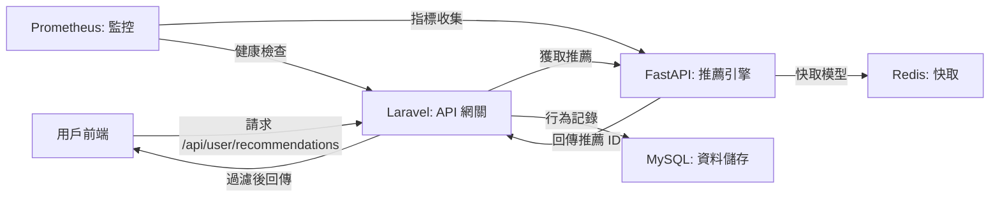

# 推薦系統專案

這是一個技術導向的推薦系統專案，採用跨語言微服務架構，結合 Laravel 和 FastAPI，透過關鍵代碼實現個性化商品推薦、A/B 測試、商品上下架管理與監控。以下說明專案的功能、架構、核心實現與擴充性。文件更新時間：2025 年 6 月 24 日下午 5:47 (CST)。

## 專案概述
**功能**：
- **個性化推薦**：透過 Laravel 的 `/api/user/recommendations` 路由，向 FastAPI 請求推薦結果，過濾上架商品後回傳給前端。
- **A/B 測試**：動態分組（Thompson Sampling）比較推薦策略，提升點擊率與轉化率。
- **商品管理**：管理商品資訊與上下架狀態，確保推薦符合業務需求。
- **行為追蹤**：記錄用戶曝光與點擊行為，支援模型訓練與效果分析。
- **即時監控**：監控系統性能（延遲、錯誤率）與推薦品質（冷啟動比例、重複率、多樣性、覆蓋率、熵值）。

**技術亮點**：
- **微服務解耦**：Laravel 作為 API 網關整合推薦流程，FastAPI 專注模型推論與訓練。
- **高效快取**：Redis 儲存模型、行為與推薦結果，支援重複率計算與隊列。
- **自動化訓練**：APScheduler 每 6 小時更新模型，確保推薦即時性。
- **可觀測性**：Prometheus 與 Grafana 提供全面指標監控與告警。

**目的**：
- 提供精準的個性化推薦，優化用戶體驗與業務指標。
- 透過 A/B 測試持續改進推薦策略，支援 Retail Media Network 等場景。
- 確保系統穩定性與高可維護性，快速響應問題。

**核心流程**：
1. 用戶前端訪問 `/api/user/recommendations`，Laravel 進行 A/B 分組。
2. Laravel 透過 REST 請求向 FastAPI 傳遞用戶 ID 與策略版本。
3. FastAPI 基於協同過濾生成推薦（僅上架商品），回傳商品 ID 給 Laravel。
4. Laravel 透過 `Product::active()` 二次過濾，回傳處理後的結果給前端。
5. 用戶行為記錄至 MySQL，供 FastAPI 訓練與監控分析。

## 系統架構
以下是架構圖，清晰展示 FastAPI 推薦結果回傳 Laravel，並最終回傳前端的流程：



- **Laravel**：處理 `/api/user/recommendations` 請求，負責 A/B 分組、行為記錄與上下架過濾，回傳前端。
- **FastAPI**：生成推薦結果，回傳給 Laravel，定時更新模型。
- **MySQL**：儲存用戶、商品（含 `status`）與行為事件（`recommendation_events`）。
- **Redis**：快取模型與行為，支援效能與重複率計算。
- **Prometheus**：監控推薦品質與系統狀態。
- **Docker Compose**：統一容器管理（假設環境已配置）。

## 環境需求
- PHP 8.2（Laravel，含 Composer）
- Python 3.9（FastAPI，含 pip）
- MySQL（含適當權限）
- Redis（用於快取與隊列）
- Prometheus（用於監控，選配）

**注意**：此倉庫僅包含關鍵代碼，需自行配置運行環境（如 Docker 或本地服務）。

## 專案結構
```
recommendation-system/
├── laravel-app/                # Laravel 關鍵代碼
│   ├── app/                   # 中間件、服務、模型
│   │   ├── Http/             # Middleware 檔案
│   │   ├── Services/         # RecommendationService
│   │   └── Models/           # Product 模型
│   └── routes/                # API 路由
├── ai-recommender-service/     # FastAPI 關鍵代碼
│   ├── recommender.py         # 推薦邏輯
│   └── main.py                # FastAPI 主程式（需自行補全）
```

## 啟動步驟
由於此 GitHub 倉庫僅包含關鍵代碼，假設你已擁有運行環境（例如本地或 Docker 配置）。以下是基於代碼的最小化啟動步驟：

1. **配置環境**：
   - 確保 PHP 8.2、Python 3.9、MySQL 和 Redis 已安裝並運行。
   - 創建 `.env` 文件，參考以下範例（根據實際環境調整）：
     ```env
     APP_KEY=your_app_key
     DB_HOST=localhost
     DB_DATABASE=laravel
     DB_USERNAME=your_user
     DB_PASSWORD=your_password
     REDIS_HOST=localhost
     RECOMMENDATION_API_URL=http://localhost:8000
     RECOMMENDATION_AB_TEST_SALT=some_random_salt
     ```

2. **安裝依賴**：
   - Laravel 依賴：`composer install`（在 `laravel-app` 目錄下）。
   - FastAPI 依賴：`pip install -r requirements.txt`（在 `ai-recommender-service` 目錄下，需自行創建 `requirements.txt`，包含 `fastapi`、`uvicorn`、`scikit-learn` 等）。

3. **運行服務**：
   - 啟動 Laravel：`php artisan serve`（在 `laravel-app` 目錄下，預設端口 8000）。
   - 啟動 FastAPI：`uvicorn main.py:app --host 0.0.0.0 --port 8000`（在 `ai-recommender-service` 目錄下，需確保 `main.py` 包含路由定義）。
   - 確保 MySQL 和 Redis 已連線。

4. **測試 API**：
   - 訪問 `http://localhost:8000/api/user/recommendations`（需先模擬登入，如 `http://localhost:8000/login-test/1`）。
   - 追蹤點擊：POST `http://localhost:8000/api/track/click` 測試行為記錄。

5. **監控（選配）**：
   - 若已配置 Prometheus，確保 FastAPI 暴露 `/metrics` 端點，檢查 `http://localhost:9090`。

**注意**：此步驟假設你有基本環境配置（如 Docker Compose 或本地服務）。如需完整部署，請參考專案的環境設置範本或自行補充。

## 使用方式
- **推薦 API**：`http://localhost:8000/api/user/recommendations`
  - 先訪問 `http://localhost:8000/login-test/1` 模擬登入（用戶 ID 1）。
- **商品列表**：`http://localhost:8000/products`（需實現 Blade 模板）。
- **追蹤點擊**：POST `http://localhost:8000/api/track/click`：
  ```json
  {
      "product_id": 1,
      "group": "control",
      "experiment_name": "default_recommendation_experiment"
  }
  ```
- **FastAPI 健康檢查**：`http://localhost:8000/health`（需實現）。

## 關鍵代碼解析
### 1. Laravel 中間件：A/B 分組
檔案：`laravel-app/app/Http/Middleware/AssignRecommendationGroup.php`
```php
public function handle(Request $request, Closure $next)
{
    // 獲取當前用戶 ID，若無登入則使用 0
    $userId = Auth::id() ?? 0;

    // 設定預設實驗名稱與配置
    $experimentName = 'default_recommendation_experiment';
    $experimentConfig = config('ab_test.experiments.' . $experimentName);

    // 若實驗未啟用，返回預設分組
    if (!isset($experimentConfig['enabled']) || !$experimentConfig['enabled']) {
        $assignedGroup = $experimentConfig['default_group'] ?? 'control';
    } else {
        // 處理訪客用戶，使用 session ID 進行加權隨機分組
        if (!$userId) {
            $guestId = session()->getId();
            $assignedGroup = $this->assignGroupWithWeight($guestId, $experimentConfig['groups'], config('ab_test.salt'));
            session(['recommendation_group' => $assignedGroup]);
        } else {
            // 處理已登入用戶，使用 Thompson Sampling 動態分配
            $user = Auth::user();
            $assignedGroup = $user->recommendation_group ?: $this->assignGroupWithThompsonSampling($userId, $experimentName, $experimentConfig['groups']);
            $user->recommendation_group = $assignedGroup;
            $user->save();
        }
    }

    // 將分組與用戶 ID 儲存至請求屬性，供後續使用
    $request->attributes->set('recommendation_group', $assignedGroup);
    $request->attributes->set('current_user_id', $userId);
    return $next($request);
}
```
**解析**：實現 A/B 測試分組，支援訪客與已登入用戶的不同策略，確保分組一致性並記錄。

### 2. Laravel 推薦服務
檔案：`laravel-app/app/Services/RecommendationService.php`
```php
public function getRecommendations(int $userId, string $strategyVersion = 'v1'): array
{
    try {
        // 向 FastAPI 發送推薦請求，傳遞用戶 ID 與策略版本
        $response = $this->httpClient->get("/recommend/$userId", [
            'query' => ['strategy_version' => $strategyVersion]
        ]);

        // 解析 FastAPI 回傳的 JSON，提取推薦商品 ID
        $data = json_decode($response->getBody()->getContents(), true);
        $recommendedProductIds = $data['recommended_product_ids'] ?? [];

        // 從 MySQL 查詢上架商品，過濾推薦結果
        $recommendations = Product::whereIn('id', $recommendedProductIds)
                                 ->active()
                                 ->get(['id', 'name', 'price', 'category_id', 'image_url'])
                                 ->toArray();

        // 按推薦順序重新排序商品
        $orderedRecommendations = [];
        foreach ($recommendedProductIds as $id) {
            foreach ($recommendations as $product) {
                if ($product['id'] == $id) {
                    $orderedRecommendations[] = $product;
                    break;
                }
            }
        }

        return $orderedRecommendations;
    } catch (RequestException $e) {
        // 若 FastAPI 失敗，回退至隨機推薦上架商品
        Log::error("Failed to get recommendations: " . $e->getMessage());
        return Product::active()->inRandomOrder()->limit(10)->get()->toArray();
    }
}
```
**解析**：從 FastAPI 獲取推薦 ID，進行二次過濾並回傳前端，包含容錯機制。

### 3. FastAPI 推薦邏輯
檔案：`ai-recommender-service/recommender.py`
```python
def get_recommendations(self, user_id: int, strategy_version: str = 'v1', num_recommendations: int = 10) -> list[int]:
    # 獲取用戶最近觀看商品
    viewed_products = self._get_user_recent_views(user_id)
    # 獲取所有活躍商品 ID
    all_active_product_ids = list(self.products.keys())

    # 若無活躍商品，返回空列表
    if not all_active_product_ids:
        return []

    generated_recommendations = []

    if strategy_version == 'v1':
        # 若有觀看記錄且模型已訓練，進行協同過濾
        if viewed_products and not self.item_similarity_df.empty:
            available_viewed_products = [p for p in viewed_products if p in self.item_similarity_df.columns and p in self.products and self.products[p]['status'] == 'active']
            if available_viewed_products:
                seen_products_df = self.item_similarity_df[available_viewed_products]
                sum_similarities = seen_products_df.sum(axis=1)
                # 排除已觀看商品，排序相似度
                candidate_recommendations = sum_similarities.drop(viewed_products, errors='ignore').sort_values(ascending=False).index.tolist()
                
                for pid in candidate_recommendations:
                    if pid in self.products and self.products[p]['status'] == 'active':
                        generated_recommendations.append(pid)
                        if len(generated_recommendations) >= num_recommendations:
                            break
        
        # 若不足數量，隨機補充活躍商品
        if len(generated_recommendations) < num_recommendations:
            remaining_active_products = [p for p in all_active_product_ids if p not in generated_recommendations and p not in viewed_products]
            random.shuffle(remaining_active_products)
            generated_recommendations.extend(remaining_active_products[:num_recommendations - len(generated_recommendations)])

    return generated_recommendations[:num_recommendations]
```
**解析**：實現協同過濾推薦，處理冷啟動並確保返回指定數量商品。

### 4. 商品模型
檔案：`laravel-app/app/Models/Product.php`
```php
class Product extends Model
{
    // 定義可批量賦值的字段
    protected $fillable = ['name', 'description', 'price', 'category_id', 'image_url', 'status'];
    // 將 price 字段轉為小數格式，保留兩位
    protected $casts = ['price' => 'decimal:2'];

    // 定義活躍商品查詢範圍
    public function scopeActive($query)
    {
        return $query->where('status', 'active');
    }
}
```
**解析**：定義商品模型結構與活躍狀態過濾邏輯。

## 監控與告警
- **Prometheus**：監控冷啟動、重複率、多樣性、覆蓋率、熵值（`prometheus/alert.rules.yml`，需自行配置）。
- **Grafana**：可視化儀表板，支援告警（需自行設置）。

## 常見問題
1. **問題**：推薦清單含下架商品？
   **解決**：檢查 `RecommendationService` 的 `Product::active()` 與 MySQL 的 `products` 表狀態。

2. **問題**：FastAPI 無回應？
   **解決**：
   - 檢查 `uvicorn` 是否運行。
   - 查看 FastAPI 日誌（`main.py` 輸出）。

3. **問題**：Laravel API 無數據？
   **解決**：確認 FastAPI URL（`.env` 中的 `RECOMMENDATION_API_URL`）正確，並檢查網路連通性。

## 問與答
### 1. 架構與設計
**Q1.1：整體架構與技術選型原因？**
**答**：本專案採用微服務架構，將 Laravel 作為 API 網關處理請求與業務邏輯，FastAPI 負責推薦推論與模型訓練。技術選型原因如下：
- **Laravel (PHP)**：生態成熟，適合快速構建 Web API、A/B 測試分組與行為追蹤，與 MySQL 整合無縫。
- **FastAPI (Python)**：異步框架，結合 scikit-learn 和 Pandas，擅長 AI 模型訓練與推論，處理計算密集任務效率高。
- **MySQL**：穩定性高，支援 ACID 事務，適合儲存結構化數據。
- **Redis**：記憶體資料庫，提供低延遲快取與隊列功能，加速模型存取。
- **Prometheus & Grafana**：開源監控工具，支援自定義指標與可視化，適合實時監控。

**Q1.2：為什麼分離 FastAPI 作為獨立服務？**
**答**：分離 FastAPI 的主要考量包括：
- Python 的 AI/ML 生態優於 PHP，FastAPI 異步高效。
- Laravel 專注 API 整合，FastAPI 專注推薦推論，降低耦合。
- FastAPI 可獨立擴展，適應高負載。

**Q1.3：如何確保上下架商品一致性？**
**答**：採用雙層過濾：FastAPI 內部只載入活躍商品，Laravel 透過 `Product::active()` 二次驗證。

### 2. Laravel 部分
**Q2.1：A/B 測試如何實現與動態分配？**
**答**：`AssignRecommendationGroup` 中間件實現：
- 支援 Thompson Sampling 與加權隨機分組。
- 配置在 `config/ab_test.php`，動態調整實驗。

**Q2.2：行為追蹤的實現細節與優化？**
**答**：使用 `RecommendationInteraction` 事件，異步寫入 Redis 隊列，優化 API 性能。

**Q2.3：商品上下架管理的具體實現？**
**答**：`products` 表含 `status` 欄位，`Product::active()` 過濾。

### 3. FastAPI 部分
**Q3.1：推薦模型的訓練流程與定時更新？**
**答**：使用協同過濾，APScheduler 每 6 小時訓練，模型快取至 Redis。

**Q3.2：如何處理冷啟動用戶？**
**答**：若無數據，隨機補充活躍商品，Laravel 提供備用策略。

**Q3.3：推薦結果的多樣性如何保證？**
**答**：目前靠隨機補充，未來可加入 MMR 算法。

### 4. 資料庫與快取
**Q4.1：Redis 在系統中的具體角色？**
**答**：快取模型、行為與隊列，加速存取與計算。

**Q4.2：MySQL 與 Redis 的數據同步機制？**
**答**：MySQL 為主數據庫，Redis 快取層，FastAPI 定期同步。

### 5. 監控與可觀測性
**Q5.1：監控的具體指標與實現方式？**
**答**：系統（延遲、錯誤率）、業務（冷啟動、重複率），透過 Prometheus 收集。

**Q5.2：如何設置告警規則？**
**答**：在 `alert.rules.yml` 定義冷啟動 > 30% 等條件。

**Q5.3：如何分析推薦效果？**
**答**：使用 Grafana 視覺化 CTR、轉化率，SQL 分析 A/B 結果。

### 6. A/B 測試
**Q6.1：A/B 測試的具體實現細節？**
**答**：`AssignRecommendationGroup` 使用 Thompson Sampling，記錄分組至 `users` 或 session。

**Q6.2：如何評估 A/B 測試效果？**
**答**：基於 CTR、轉化率，採用 t 檢驗驗證顯著性。

### 7. 優化與改進
**Q7.1：如何實現模型的自動化與增量訓練？**
**答**：APScheduler 觸發訓練，未來支援增量更新與分布式訓練。

**Q7.2：如何提升推薦的多樣性與新鮮感？**
**答**：加入 MMR 或時間衰減因子，測試多樣性策略。

### 8. 故障排除
**Q8.1：FastAPI 服務故障的排查步驟？**
**答**：檢查容器、端點、日誌，驗證依賴服務。

**Q8.2：推薦結果異常（如全為隨機商品）？**
**答**：檢查模型訓練數據與 FastAPI 日誌。

### 9. 未來改進與應用
**Q9.1：面對大規模數據的挑戰？**
**答**：使用 Spark 分布式訓練，Kafka 實時處理。

**Q9.2：如何支援更複雜的推薦場景？**
**答**：引入 DNN、上下文推薦，支援 Retail Media 等場景。

## 注意事項
- 確保 `.env` 設定正確。
- 定期檢查監控告警，優化推薦策略。
- 初始數據需自行填充（如模擬數據）。

## 未來擴充
- **向量化推薦**：引入嵌入模型提升精準度。
- **深度模型**：使用 DNN/GNN 捕捉複雜行為。
- **實時推薦**：整合 Kafka/Flink 處理流式數據。
- **場景應用**：支援 Retail Media Network、SaaS 行銷平台。

有問題請查看日誌或聯繫，謝謝！
