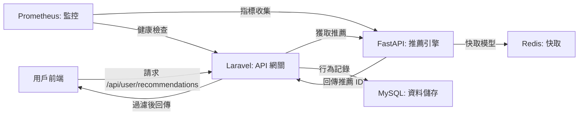

# 推薦系統專案

這是一個技術導向的推薦系統專案，採用跨語言微服務架構，結合 Laravel 和 FastAPI，透過 Docker 環境實現個性化商品推薦、A/B 測試、商品上下架管理與即時監控。以下說明專案的功能、架構、核心實現與擴充性。文件更新時間：2025 年 6 月 24 日下午 5:45 (CST)。

## 專案概述
**功能**：
- **個性化推薦**：透過 Laravel 的 `/api/user/recommendations` 路由，向 FastAPI 請求推薦結果，過濾上架商品後回傳給前端。
- **A/B 測試**：動態分組（Thompson Sampling）比較推薦策略，提升點擊率與轉化率。
- **商品管理**：管理商品資訊與上下架狀態，確保推薦符合業務需求。
- **行為追蹤**：記錄用戶曝光與點擊行為，支援模型訓練與效果分析。
- **即時監控**：監控系統性能（延遲、錯誤率）與推薦品質（冷啟動比例、重複率、多樣性、覆蓋率、熵值）。

**技術亮點**：
- **微服務解耦**：Laravel 作為 API 網關整合推薦流程，FastAPI 專注模型推論與訓練。
- **高效快取**：Redis 儲存模型、行為與推薦結果，支援重複率計算與隊列。
- **自動化訓練**：APScheduler 每 6 小時更新模型，確保推薦即時性。
- **可觀測性**：Prometheus 與 Grafana 提供全面指標監控與告警。

**目的**：
- 提供精準的個性化推薦，優化用戶體驗與業務指標。
- 透過 A/B 測試持續改進推薦策略，支援 Retail Media Network 等場景。
- 確保系統穩定性與高可維護性，快速響應問題。

**核心流程**：
1. 用戶前端訪問 `/api/user/recommendations`，Laravel 進行 A/B 分組。
2. Laravel 透過 REST 請求向 FastAPI 傳遞用戶 ID 與策略版本。
3. FastAPI 基於協同過濾生成推薦（僅上架商品），回傳商品 ID 給 Laravel。
4. Laravel 透過 `Product::active()` 二次過濾，回傳處理後的結果給前端。
5. 用戶行為記錄至 MySQL，供 FastAPI 訓練與監控分析。

## 系統架構
以下是架構圖，清晰展示 FastAPI 推薦結果回傳 Laravel，並最終回傳前端的流程：



- **Laravel**：處理 `/api/user/recommendations` 請求，負責 A/B 分組、行為記錄與上下架過濾，回傳前端。
- **FastAPI**：生成推薦結果，回傳給 Laravel，定時更新模型。
- **MySQL**：儲存用戶、商品（含 `status`）與行為事件（`recommendation_events`）。
- **Redis**：快取模型與行為，支援效能與重複率計算。
- **Prometheus**：監控推薦品質與系統狀態。
- **Docker Compose**：統一容器管理，確保環境一致。

## 環境需求
- Docker & Docker Compose
- PHP 8.2（Laravel）
- Python 3.9（FastAPI）
- Composer（Laravel 依賴）
- pip（Python 依賴）

## 專案結構
```
recommendation-system/
├── laravel-app/                # Laravel 應用
│   ├── app/                   # 邏輯（中間件、服務、模型）
│   ├── config/                # 設定（A/B 測試）
│   ├── database/              # 遷移與填充
│   ├── docker/                # Nginx/Supervisor
│   ├── resources/views/       # Blade 模板
│   └── routes/                # API/Web 路由
├── ai-recommender-service/     # FastAPI 服務
│   ├── model/                 # 模型儲存
│   ├── main.py                # FastAPI 主程式
│   ├── recommender.py         # 推薦邏輯
│   └── requirements.txt       # Python 依賴
├── prometheus/                # Prometheus 設定
├── grafana/                   # Grafana 設定
├── .env                       # 環境變數
└── docker-compose.yml         # 容器編排
```

## 啟動步驟
1. **確認環境變數**：
   - 檢查 `.env`，包含：
     ```env
     APP_KEY=
     DB_HOST=mysql
     DB_DATABASE=laravel
     DB_USERNAME=laravel_user
     DB_PASSWORD=laravel_password
     REDIS_HOST=redis
     RECOMMENDATION_API_URL=http://fastapi-recommender:8000
     RECOMMENDATION_AB_TEST_SALT=some_random_salt
     ```
   - 若無 `.env`，複製 `laravel-app/.env.example`：
     ```bash
     cp laravel-app/.env.example .env
     ```

2. **啟動 Docker**：
   ```bash
   docker compose up --build -d
   ```

3. **安裝 Laravel 依賴**：
   ```bash
   docker compose exec laravel-app composer install
   ```

4. **生成 APP_KEY**：
   ```bash
   docker compose exec laravel-app php artisan key:generate --show
   ```
   將輸出複製到 `.env` 的 `APP_KEY=`。

5. **執行遷移**：
   ```bash
   docker compose exec laravel-app php artisan migrate
   ```

6. **填充資料**：
   ```bash
   docker compose exec laravel-app php artisan db:seed --class=ProductSeeder
   ```

7. **綁定事件**：
   編輯 `laravel-app/app/Providers/EventServiceProvider.php`：
   ```php
   protected $listen = [
       'App\Events\RecommendationInteraction' => [
           'App\Listeners\LogRecommendationInteraction',
       ],
   ];
   ```

8. **安裝 FastAPI 依賴**：
   ```bash
   docker compose exec fastapi-recommender pip install -r requirements.txt
   ```

## 使用方式
- **推薦 API**：`http://localhost:8000/api/user/recommendations`
  - 先訪問 `http://localhost:8000/login-test/1` 模擬登入（用戶 ID 1）。
- **商品列表**：`http://localhost:8000/products`（Blade 模板）。
- **追蹤點擊**：POST `http://localhost:8000/api/track/click`：
  ```json
  {
      "product_id": 1,
      "group": "control",
      "experiment_name": "default_recommendation_experiment"
  }
  ```
- **FastAPI 健康檢查**：`http://localhost:8001/health`
- **監控**：
  - Prometheus：`http://localhost:9090`
  - Grafana：`http://localhost:3000`（帳密：`admin/admin`）

## 關鍵代碼解析
### 1. Laravel 中間件：A/B 分組
檔案：`laravel-app/app/Http/Middleware/AssignRecommendationGroup.php`
```php
public function handle(Request $request, Closure $next)
{
    // 獲取當前用戶 ID，若無登入則使用 0
    $userId = Auth::id() ?? 0;

    // 設定預設實驗名稱與配置
    $experimentName = 'default_recommendation_experiment';
    $experimentConfig = config('ab_test.experiments.' . $experimentName);

    // 若實驗未啟用，返回預設分組
    if (!isset($experimentConfig['enabled']) || !$experimentConfig['enabled']) {
        $assignedGroup = $experimentConfig['default_group'] ?? 'control';
    } else {
        // 處理訪客用戶，使用 session ID 進行加權隨機分組
        if (!$userId) {
            $guestId = session()->getId();
            $assignedGroup = $this->assignGroupWithWeight($guestId, $experimentConfig['groups'], config('ab_test.salt'));
            session(['recommendation_group' => $assignedGroup]);
        } else {
            // 處理已登入用戶，使用 Thompson Sampling 動態分配
            $user = Auth::user();
            $assignedGroup = $user->recommendation_group ?: $this->assignGroupWithThompsonSampling($userId, $experimentName, $experimentConfig['groups']);
            $user->recommendation_group = $assignedGroup;
            $user->save();
        }
    }

    // 將分組與用戶 ID 儲存至請求屬性，供後續使用
    $request->attributes->set('recommendation_group', $assignedGroup);
    $request->attributes->set('current_user_id', $userId);
    return $next($request);
}
```
**解析**：實現 A/B 測試分組，支援訪客與已登入用戶的不同策略，確保分組一致性並記錄。

### 2. Laravel 推薦服務
檔案：`laravel-app/app/Services/RecommendationService.php`
```php
public function getRecommendations(int $userId, string $strategyVersion = 'v1'): array
{
    try {
        // 向 FastAPI 發送推薦請求，傳遞用戶 ID 與策略版本
        $response = $this->httpClient->get("/recommend/$userId", [
            'query' => ['strategy_version' => $strategyVersion]
        ]);

        // 解析 FastAPI 回傳的 JSON，提取推薦商品 ID
        $data = json_decode($response->getBody()->getContents(), true);
        $recommendedProductIds = $data['recommended_product_ids'] ?? [];

        // 從 MySQL 查詢上架商品，過濾推薦結果
        $recommendations = Product::whereIn('id', $recommendedProductIds)
                                 ->active()
                                 ->get(['id', 'name', 'price', 'category_id', 'image_url'])
                                 ->toArray();

        // 按推薦順序重新排序商品
        $orderedRecommendations = [];
        foreach ($recommendedProductIds as $id) {
            foreach ($recommendations as $product) {
                if ($product['id'] == $id) {
                    $orderedRecommendations[] = $product;
                    break;
                }
            }
        }

        return $orderedRecommendations;
    } catch (RequestException $e) {
        // 若 FastAPI 失敗，回退至隨機推薦上架商品
        Log::error("Failed to get recommendations: " . $e->getMessage());
        return Product::active()->inRandomOrder()->limit(10)->get()->toArray();
    }
}
```
**解析**：從 FastAPI 獲取推薦 ID，進行二次過濾並回傳前端，包含容錯機制。

### 3. FastAPI 推薦邏輯
檔案：`ai-recommender-service/recommender.py`
```python
def get_recommendations(self, user_id: int, strategy_version: str = 'v1', num_recommendations: int = 10) -> list[int]:
    # 獲取用戶最近觀看商品
    viewed_products = self._get_user_recent_views(user_id)
    # 獲取所有活躍商品 ID
    all_active_product_ids = list(self.products.keys())

    # 若無活躍商品，返回空列表
    if not all_active_product_ids:
        return []

    generated_recommendations = []

    if strategy_version == 'v1':
        # 若有觀看記錄且模型已訓練，進行協同過濾
        if viewed_products and not self.item_similarity_df.empty:
            available_viewed_products = [p for p in viewed_products if p in self.item_similarity_df.columns and p in self.products and self.products[p]['status'] == 'active']
            if available_viewed_products:
                seen_products_df = self.item_similarity_df[available_viewed_products]
                sum_similarities = seen_products_df.sum(axis=1)
                # 排除已觀看商品，排序相似度
                candidate_recommendations = sum_similarities.drop(viewed_products, errors='ignore').sort_values(ascending=False).index.tolist()
                
                for pid in candidate_recommendations:
                    if pid in self.products and self.products[p]['status'] == 'active':
                        generated_recommendations.append(pid)
                        if len(generated_recommendations) >= num_recommendations:
                            break
        
        # 若不足數量，隨機補充活躍商品
        if len(generated_recommendations) < num_recommendations:
            remaining_active_products = [p for p in all_active_product_ids if p not in generated_recommendations and p not in viewed_products]
            random.shuffle(remaining_active_products)
            generated_recommendations.extend(remaining_active_products[:num_recommendations - len(generated_recommendations)])

    return generated_recommendations[:num_recommendations]
```
**解析**：實現協同過濾推薦，處理冷啟動並確保返回指定數量商品。

### 4. 商品模型
檔案：`laravel-app/app/Models/Product.php`
```php
class Product extends Model
{
    // 定義可批量賦值的字段
    protected $fillable = ['name', 'description', 'price', 'category_id', 'image_url', 'status'];
    // 將 price 字段轉為小數格式，保留兩位
    protected $casts = ['price' => 'decimal:2'];

    // 定義活躍商品查詢範圍
    public function scopeActive($query)
    {
        return $query->where('status', 'active');
    }
}
```
**解析**：定義商品模型結構與活躍狀態過濾邏輯。

## 監控與告警
- **Prometheus**：監控冷啟動、重複率、多樣性、覆蓋率、熵值（`prometheus/alert.rules.yml`）。
- **Grafana**：可視化儀表板，支援告警。

## 常見問題
1. **問題**：推薦清單含下架商品？
   **解決**：檢查 `RecommendationService` 的 `Product::active()` 與 MySQL 的 `products` 表狀態。

2. **問題**：FastAPI 無回應？
   **解決**：
   - 檢查 `docker compose ps` 與 `/health` 端點。
   - 查看 `docker compose logs fastapi-recommender`。

3. **問題**：Prometheus 無數據？
   **解決**：
   - 確認 `/metrics` 端點（`http://fastapi-recommender:8000/metrics`）。
   - 檢查 `grafana/provisioning/datasources/prometheus.yml`。

## 問與答
### 1. 架構與設計
**Q1.1：整體架構與技術選型原因？**
**答**：本專案採用微服務架構，將 Laravel 作為 API 網關處理請求與業務邏輯，FastAPI 負責推薦推論與模型訓練。技術選型原因如下：
- **Laravel (PHP)**：生態成熟，適合快速構建 Web API、A/B 測試分組與行為追蹤，與 MySQL 整合無縫。
- **FastAPI (Python)**：異步框架，結合 scikit-learn 和 Pandas，擅長 AI 模型訓練與推論，處理計算密集任務效率高。
- **MySQL**：穩定性高，支援 ACID 事務，適合儲存結構化數據（如用戶、商品、行為事件）。
- **Redis**：記憶體資料庫，提供低延遲快取與隊列功能，加速模型存取與行為記錄。
- **Prometheus & Grafana**：開源監控工具，支援自定義指標與可視化，適合實時監控與告警。
- **Docker Compose**：統一環境管理，簡化多服務部署與網路配置。

**Q1.2：為什麼分離 FastAPI 作為獨立服務？**
**答**：分離 FastAPI 的主要考量包括技術優勢、職責分離與擴展性：
- Python 的 AI/ML 生態（如 scikit-learn、NumPy）遠超 PHP，適合實現協同過濾與模型訓練。
- Laravel 專注 API 整合與業務邏輯，FastAPI 專注推薦推論，降低耦合度，提升維護性。
- FastAPI 可獨立水平擴展（如增加實例處理高負載），無需影響 Laravel。
- 性能優化：FastAPI 的異步特性比 PHP 更適合長時間計算任務。

**Q1.3：如何確保上下架商品一致性？**
**答**：採用雙層過濾機制：
- FastAPI 內部只載入 `status = 'active'` 的商品數據（`self.products`）。
- Laravel 的 `RecommendationService` 使用 `Product::active()` 二次驗證，確保最終回傳的商品均為上架狀態。

### 2. Laravel 部分
**Q2.1：A/B 測試如何實現與動態分配？**
**答**：A/B 測試由 `AssignRecommendationGroup` 中間件實現，流程如下：
- **分組邏輯**：根據 `config/ab_test.experiments` 設定，支援多實驗（如 `default_recommendation_experiment`）。
- **已登入用戶**：使用 Thompson Sampling 基於歷史數據動態分配分組（`control` 或 `model_v2`），並儲存至 `users` 表的 `recommendation_group` 欄位。
- **訪客用戶**：使用 session ID 與加鹽哈希（`ab_test.salt`）進行加權隨機分組，確保一致性。
- **配置管理**：`config/ab_test.php` 可啟用/禁用實驗，並設定權重與預設分組。

**Q2.2：行為追蹤的實現細節與優化？**
**答**：
- **事件定義**：`RecommendationInteraction` 事件記錄「曝光」（impression）與「點擊」（click），包含 `user_id`、`product_id`、`group`、`action` 等字段。
- **異步處理**：`LogRecommendationInteraction` 監聽器實現 `ShouldQueue`，將事件推送到 Redis 隊列，異步寫入 `recommendation_events` 表，減少 API 延遲。
- **優化點**：隊列使用 Redis 確保高吞吐量，可根據負載調整工作者數量（`php artisan queue:work`）。

**Q2.3：商品上下架管理的具體實現？**
**答**：使用 Eloquent ORM 管理：
- `products` 表包含 `status` 欄位（`active`、`inactive`、`sold_out`）。
- `Product` 模型定義 `scopeActive()` 方法，`RecommendationService` 透過 `Product::whereIn('id', $ids)->active()` 過濾。
- 上下架狀態由後台管理（如 `php artisan db:seed` 或管理介面），確保實時更新。

### 3. FastAPI 部分
**Q3.1：推薦模型的訓練流程與定時更新？**
**答**：
- **模型類型**：基於物品的協同過濾，使用 `scikit-learn` 的 `cosine_similarity` 計算商品相似度，生成 `item_similarity_df`。
- **數據來源**：從 MySQL 的 `recommendation_events` 表提取用戶互動數據（點擊、購買），轉為用戶-商品矩陣。
- **訓練流程**：`APScheduler` 每 6 小時執行 `train_and_save_model`，從 MySQL 拉取最新數據，訓練模型並序列化儲存至 `model/item_similarity_model.pkl`，同時快取至 Redis。
- **熱更新**：新模型直接替換 `self.item_similarity_df`，無需重啟服務。

**Q3.2：如何處理冷啟動用戶？**
**答**：
- **識別**：若 `user_id` 無互動數據（例如新用戶或 ID 為 0），視為冷啟動。
- **策略**：`get_recommendations` 優先使用協同過濾，若無數據，隨機從活躍商品中補充。
- **備用方案**：Laravel 的 `RecommendationService` 在 FastAPI 失敗時，回退至 `Product::active()->inRandomOrder()->limit(10)`。
- **改進潛力**：可加入熱門商品推薦或基於用戶屬性（年齡、地區）的內容推薦。

**Q3.3：推薦結果的多樣性如何保證？**
**答**：目前使用協同過濾，基於相似度排序。為提升多樣性，可：
- 在 `get_recommendations` 中加入隨機補充（`remaining_active_products`）。
- 未來引入多臂老虎機（Multi-Armed Bandit）或最大邊界相關性（MMR）算法。

### 4. 資料庫與快取
**Q4.1：Redis 在系統中的具體角色？**
**答**：
- **模型快取**：儲存 `item_similarity_model.pkl` 的序列化數據，加速 FastAPI 啟動與推論。
- **行為快取**：記錄用戶最近推薦結果（`last_recommendations:{user_id}`），用於計算重複率。
- **隊列支持**：處理 Laravel 的 `RecommendationInteraction` 事件，確保異步寫入 MySQL。
- **優勢**：相比 MySQL，Redis 提供低延遲讀寫，適合高頻訪問場景。

**Q4.2：MySQL 與 Redis 的數據同步機制？**
**答**：
- **MySQL**：作為主要數據庫，儲存結構化數據（如 `users`、`products`、`recommendation_events`），由 Laravel 與 FastAPI 讀取。
- **Redis**：作為快取層，數據由 FastAPI 定期從 MySQL 同步（訓練時更新 `self.products`），Laravel 透過隊列更新行為數據。
- **一致性**：FastAPI 訓練後將模型快取至 Redis，Laravel 依賴 MySQL 作為最終數據來源，確保一致性。

### 5. 監控與可觀測性
**Q5.1：監控的具體指標與實現方式？**
**答**：
- **系統指標**：請求延遲（`http_request_duration_seconds`）、錯誤率（`http_requests_total{status=5xx}`），由 Prometheus 從 FastAPI 和 Laravel 收集。
- **業務指標**：
  - 冷啟動比例：無互動用戶推薦比例。
  - 重複率：連續推薦中相同商品比例（Redis 計算交集）。
  - 多樣性：推薦列表的類別熵值（`category_entropy`）。
  - 覆蓋率：推薦商品佔所有活躍商品的比例。
- **實現**：FastAPI 暴露 `/metrics` 端點，Prometheus 每 15 秒抓取，Grafana 提供儀表板。

**Q5.2：如何設置告警規則？**
**答**：在 `prometheus/alert.rules.yml` 中定義：
- 冷啟動比例 > 30% 持續 5 分鐘，觸發 Email/Slack 通知。
- 重複率 > 80% 持續 10 分鐘，觸發告警。
- 請求延遲 > 500ms 持續 1 分鐘，通知運維。

**Q5.3：如何分析推薦效果？**
**答**：使用 Grafana 儀表板視覺化 CTR（點擊率）、轉化率與曝光量，結合 SQL 查詢 `recommendation_events` 表分析 A/B 測試結果。

### 6. A/B 測試
**Q6.1：A/B 測試的具體實現細節？**
**答**：
- **分組算法**：`AssignRecommendationGroup` 使用 Thompson Sampling 基於貝葉斯概率優化分組，動態調整 `control` 和 `model_v2` 的流量。
- **實驗管理**：`config/ab_test.php` 定義實驗名稱、權重與預設分組，支援動態啟用/禁用。
- **數據記錄**：每個請求的 `recommendation_group` 記錄至 `users` 表或 session，供後續分析。

**Q6.2：如何評估 A/B 測試效果？**
**答**：
- **指標**：CTR（點擊/曝光）、轉化率（購買/點擊）、曝光量。
- **分析方法**：使用 SQL 聚合查詢（`SELECT group, COUNT(*) FROM recommendation_events GROUP BY group`）或 Grafana 面板。
- **統計驗證**：採用 t 檢驗或卡方檢驗，確保結果顯著性（p < 0.05）。

### 7. 優化與改進
**Q7.1：如何實現模型的自動化與增量訓練？**
**答**：
- **自動化**：APScheduler 每 6 小時觸發全量訓練，未來可改進為增量訓練（僅更新新數據）。
- **版本管理**：儲存多個模型版本（`model/item_similarity_model_vX.pkl`），支援回滾。
- **離線評估**：使用歷史數據計算 RMSE 或 Precision@K，驗證模型效果。
- **分布式訓練**：結合 Dask 或 Spark，處理大規模數據。

**Q7.2：如何提升推薦的多樣性與新鮮感？**
**答**：
- **多樣性**：引入 MMR 算法或類別限制，確保推薦涵蓋多個類別。
- **新鮮感**：增加時間衰減因子（衰減舊互動權重）或加入熱門商品推薦。
- **A/B 測試**：測試多樣性策略的影響，優化用戶留存率。

### 8. 故障排除
**Q8.1：FastAPI 服務故障的排查步驟？**
**答**：
1. 檢查容器狀態：`docker compose ps`，確認 `fastapi-recommender` 運行。
2. 測試健康檢查：`curl http://localhost:8001/health`。
3. 查看日誌：`docker compose logs fastapi-recommender`，檢查錯誤（如模型載入失敗）。
4. 驗證依賴：確認 MySQL 和 Redis 可連通。
5. 重啟服務：`docker compose restart fastapi-recommender`。

**Q8.2：推薦結果異常（如全為隨機商品）？**
**答**：
- 檢查 FastAPI 日誌，確認 `item_similarity_df` 是否訓練成功。
- 驗證 MySQL 的 `recommendation_events` 表是否有足夠數據。
- 執行 `docker compose exec fastapi-recommender python main.py` 測試模型。

### 9. 未來改進與應用
**Q9.1：面對大規模數據的挑戰？**
**答**：
- **分布式訓練**：使用 Spark 或 Ray 處理大規模用戶行為數據。
- **實時推薦**：整合 Kafka 與 Flink，支援流式數據處理。
- **快取優化**：採用 Memcached 或 Redis Cluster，提升高並發場景性能。

**Q9.2：如何支援更複雜的推薦場景？**
**答**：
- **深度學習**：引入 DNN 或 GNN，捕捉用戶行為的非線性模式（需 TensorFlow/PyTorch 支援）。
- **上下文推薦**：新增 `context` 參數（如時間、位置），結合 Bert 模型生成上下文嵌入。
- **可解釋性**：添加推薦理由（例如「因您喜歡類似商品」），提升用戶信任。
- **應用場景**：支援 Retail Media Network（廣告推薦）、內容平台（文章推薦）、SaaS 行銷（個性化推送）。

## 注意事項
- 確保 `.env` 設定正確。
- 定期檢查監控告警，優化推薦策略。
- 初始數據可透過 `ProductSeeder` 填充。

## 未來擴充
- **向量化推薦**：引入嵌入模型（如 Sentence-BERT）提升精準度。
- **深度模型**：使用 DNN/GNN 捕捉複雜行為。
- **實時推薦**：整合 Kafka/Flink 處理流式數據。
- **場景應用**：支援 Retail Media Network、SaaS 行銷平台。

有問題請查看日誌或聯繫，謝謝！
