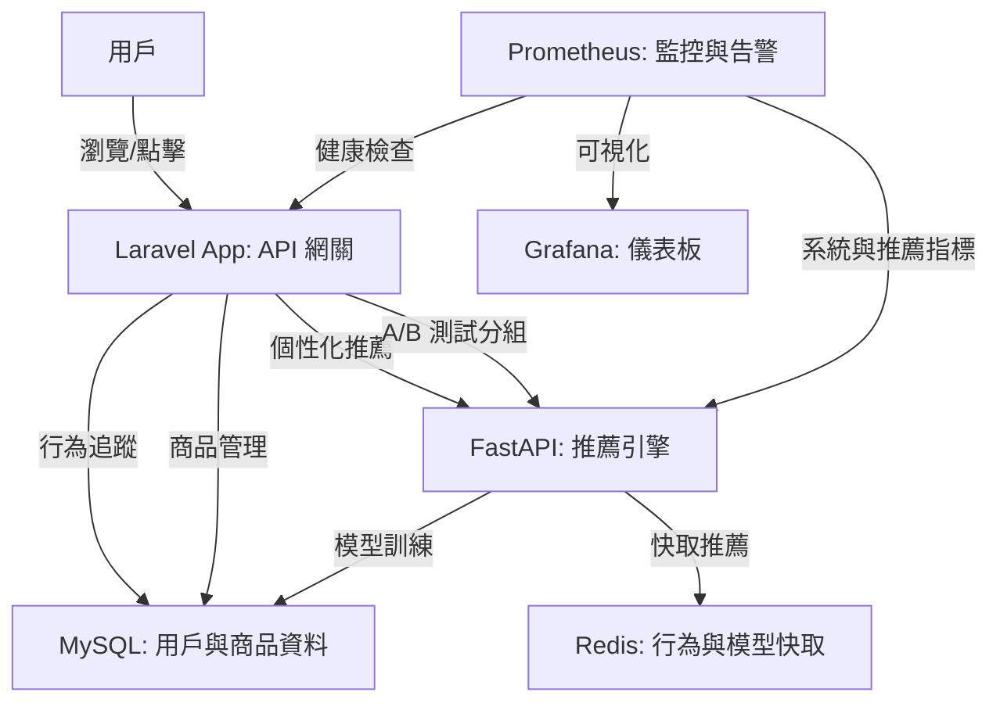

# 推薦系統專案

這是一個簡潔的推薦系統專案，結合 Laravel 和 FastAPI，透過 Docker 環境實現 A/B 測試、商品上下架管理與即時監控。以下說明專案結構、啟動方式、關鍵代碼、常見問題與問與答。

## 專案概述
本專案提供一個可擴展的推薦系統，Laravel 負責 API 與資料管理，FastAPI 處理推薦邏輯，僅推薦上架商品，並透過 Prometheus 和 Grafana 監控系統表現。A/B 測試用於比較不同推薦策略的效果，並記錄用戶行為以優化模型。

## 系統架構
以下是專案架構圖，展示各組件互動：



- **Laravel App**：處理 API 路由、A/B 測試分組、商品與用戶資料管理。
- **FastAPI**：執行推薦邏輯，支援多版本策略（v1/v2），定時更新模型與商品資料。
- **MySQL**：儲存商品（含上下架狀態）、用戶資料與推薦事件。
- **Redis**：快取模型與用戶行為，提升效能並追蹤重複率。
- **Prometheus & Grafana**：監控冷啟動比例、重複率與商品覆蓋率，提供告警。
- **Docker Compose**：確保環境一致性，簡化部署。

## 環境需求
- Docker & Docker Compose
- PHP 8.2（Laravel）
- Python 3.9（FastAPI）
- Composer（Laravel 依賴管理）
- pip（Python 依賴管理）

## 專案結構
假設你已擁有核心代碼，結構如下：
```
recommendation-system/
├── laravel-app/                # Laravel 應用程式
│   ├── app/                   # 核心邏輯（中間件、服務、模型）
│   ├── config/                # 設定檔（含 A/B 測試）
│   ├── database/              # 遷移與資料填充
│   ├── docker/                # Nginx 和 Supervisor 設定
│   ├── resources/views/       # Blade 模板（商品列表）
│   └── routes/                # API 與 Web 路由
├── ai-recommender-service/     # FastAPI 推薦服務
│   ├── model/                 # 模型儲存
│   ├── main.py                # FastAPI 主程式
│   ├── recommender.py         # 推薦邏輯
│   └── requirements.txt       # Python 依賴
├── prometheus/                # Prometheus 設定與告警規則
├── grafana/                   # Grafana 資料來源設定
├── .env                       # 環境變數
└── docker-compose.yml         # Docker 服務定義
```

## 啟動步驟
假設你只有核心代碼（已包含上述結構，但無初始化腳本），以下是啟動步驟：

1. **確認環境變數**：
   - 檢查根目錄下的 `.env` 檔案，確保包含以下關鍵設定：
     ```env
     APP_KEY= # 留空，稍後生成
     DB_CONNECTION=mysql
     DB_HOST=mysql
     DB_PORT=3306
     DB_DATABASE=laravel
     DB_USERNAME=laravel_user
     DB_PASSWORD=laravel_password
     REDIS_HOST=redis
     REDIS_PORT=6379
     RECOMMENDATION_API_URL=http://fastapi-recommender:8000
     RECOMMENDATION_AB_TEST_SALT=some_random_salt_for_ab_test
     ```
   - 若無 `.env`，從 `laravel-app/.env.example` 複製並改名：
     ```bash
     cp laravel-app/.env.example .env
     ```

2. **啟動 Docker 服務**：
   ```bash
   cd recommendation-system
   docker compose up --build -d
   ```

3. **安裝 Laravel 依賴**：
   進入 Laravel 容器並執行 Composer 安裝：
   ```bash
   docker compose exec laravel-app composer install
   ```

4. **生成 Laravel APP_KEY**：
   ```bash
   docker compose exec laravel-app php artisan key:generate --show
   ```
   將輸出的 Key 複製到 `.env` 的 `APP_KEY=`。

5. **執行資料庫遷移**：
   ```bash
   docker compose exec laravel-app php artisan migrate
   ```

6. **填充商品資料**：
   ```bash
   docker compose exec laravel-app php artisan db:seed --class=ProductSeeder
   ```

7. **綁定事件監聽器**：
   編輯 `laravel-app/app/Providers/EventServiceProvider.php`，在 `$listen` 陣列中加入：
   ```php
   protected $listen = [
       'App\Events\RecommendationInteraction' => [
           'App\Listeners\LogRecommendationInteraction',
       ],
   ];
   ```

8. **安裝 FastAPI 依賴**：
   進入 FastAPI 容器並安裝 Python 依賴：
   ```bash
   docker compose exec fastapi-recommender pip install -r requirements.txt
   ```

## 使用方式
- **推薦 API**：`http://localhost:8000/api/user/recommendations`
  - 先訪問 `http://localhost:8000/login-test/1` 模擬登入（用戶 ID 1）。
- **商品列表**：`http://localhost:8000/products` 查看所有商品（含上下架狀態）。
- **追蹤點擊**：POST 請求 `http://localhost:8000/api/track/click`：
  ```json
  {
      "product_id": 1,
      "group": "control",
      "experiment_name": "default_recommendation_experiment"
  }
  ```
- **FastAPI 健康檢查**：`http://localhost:8001/health`
- **監控**：
  - Prometheus：`http://localhost:9090`
  - Grafana：`http://localhost:3000`（帳密：`admin/admin`）

## 關鍵代碼解析
以下是核心檔案的片段與註解，說明主要邏輯。

### 1. Laravel 中間件：A/B 測試分組
檔案：`laravel-app/app/Http/Middleware/AssignRecommendationGroup.php`

```php
public function handle(Request $request, Closure $next)
{
    $userId = Auth::id();
    $experimentName = 'default_recommendation_experiment';
    $experimentConfig = config('ab_test.experiments.' . $experimentName);

    // 檢查實驗是否啟用，未啟用則使用預設分組
    if (!isset($experimentConfig['enabled']) || !$experimentConfig['enabled']) {
        $assignedGroup = $experimentConfig['default_group'] ?? 'control';
        Log::info("Experiment disabled. User {$userId} assigned to: {$assignedGroup}");
    } else {
        if (!$userId) {
            // 訪客用 session ID 確保一致性
            $guestId = session()->getId();
            $assignedGroup = $this->assignGroupWithWeight($guestId, $experimentConfig['groups'], config('ab_test.salt'));
            session(['recommendation_group' => $assignedGroup]);
            $userId = 0; // 訪客用 0 記錄
        } else {
            $user = Auth::user();
            $assignedGroup = $user->recommendation_group;

            // 若用戶尚未分配分組，使用 Thompson Sampling 動態分配
            if (!$assignedGroup) {
                $assignedGroup = $this->assignGroupWithThompsonSampling($userId, $experimentName, $experimentConfig['groups']);
                $user->recommendation_group = $assignedGroup;
                $user->save();
            }
        }
    }

    // 將分組與實驗資訊附加到請求
    $request->attributes->set('recommendation_group', $assignedGroup);
    $request->attributes->set('current_user_id', $userId);

    return $next($request);
}
```

**解析**：
- **功能**：為用戶或訪客分配 A/B 測試分組（`control` 或 `model_v2`）。
- **邏輯**：
  - 已登入用戶：檢查是否已有分組，無則用 Thompson Sampling 分配並儲存。
  - 訪客：用 session ID 和加鹽哈希確保一致分組。
  - 未啟用實驗：回退到預設分組。
- **亮點**：支援動態（Thompson Sampling）和靜態（加權隨機）分組，記錄分組供分析。

### 2. Laravel 推薦服務
檔案：`laravel-app/app/Services/RecommendationService.php`

```php
public function getRecommendations(int $userId, string $strategyVersion = 'v1'): array
{
    try {
        // 發送請求到 FastAPI
        $response = $this->httpClient->get("/recommend/$userId", [
            'query' => ['strategy_version' => $strategyVersion]
        ]);
        $data = json_decode($response->getBody()->getContents(), true);

        $recommendedProductIds = $data['recommended_product_ids'] ?? [];

        // 只獲取上架商品
        $recommendations = Product::whereIn('id', $recommendedProductIds)
                                 ->active()
                                 ->get(['id', 'name', 'price', 'category_id', 'image_url'])
                                 ->toArray();

        // 保持 FastAPI 返回的順序
        $orderedRecommendations = [];
        foreach ($recommendedProductIds as $id) {
            foreach ($recommendations as $product) {
                if ($product['id'] == $id) {
                    $orderedRecommendations[] = $product;
                    break;
                }
            }
        }

        return $orderedRecommendations;
    } catch (RequestException $e) {
        // FastAPI 失敗時回退到隨機上架商品
        Log::error("Failed to get recommendations: " . $e->getMessage());
        return Product::active()->inRandomOrder()->limit(10)->get()->toArray();
    }
}
```

**解析**：
- **功能**：向 FastAPI 請求推薦，過濾出上架商品。
- **邏輯**：
  - 使用 Guzzle HTTP 客戶端與 FastAPI 通信。
  - 查詢 MySQL 確保只返回 `status = 'active'` 的商品。
  - 若 FastAPI 失敗，回退到隨機上架商品。
- **亮點**：雙層過濾確保推薦品質，保留順序並提供備用方案。

### 3. FastAPI 推薦邏輯
檔案：`ai-recommender-service/recommender.py`

```python
def get_recommendations(self, user_id: int, strategy_version: str = 'v1', num_recommendations: int = 10) -> list[int]:
    viewed_products = self._get_user_recent_views(user_id)
    all_active_product_ids = list(self.products.keys())

    if not all_active_product_ids:
        return []

    generated_recommendations = []

    if strategy_version == 'v1':
        if viewed_products and not self.item_similarity_df.empty:
            # 過濾活躍且在模型中的產品
            available_viewed_products = [p for p in viewed_products if p in self.item_similarity_df.columns and p in self.products and self.products[p]['status'] == 'active']
            if available_viewed_products:
                seen_products_df = self.item_similarity_df[available_viewed_products]
                sum_similarities = seen_products_df.sum(axis=1)
                candidate_recommendations = sum_similarities.drop(viewed_products, errors='ignore').sort_values(ascending=False).index.tolist()
                
                # 只選取活躍商品
                for pid in candidate_recommendations:
                    if pid in self.products and self.products[p]['status'] == 'active':
                        generated_recommendations.append(pid)
                        if len(generated_recommendations) >= num_recommendations:
                            break
        
        # 不足時隨機補充活躍商品
        if len(generated_recommendations) < num_recommendations:
            remaining_active_products = [p for p in all_active_product_ids if p not in generated_recommendations and p not in viewed_products]
            random.shuffle(remaining_active_products)
            generated_recommendations.extend(remaining_active_products[:num_recommendations - len(generated_recommendations)])

    return generated_recommendations[:num_recommendations]
```

**解析**：
- **功能**：根據用戶瀏覽紀錄和策略版本生成推薦清單。
- **邏輯**：
  - 使用餘弦相似度模型計算推薦。
  - 僅推薦活躍商品（`status = 'active'`）。
  - 不足時隨機補充活躍商品。
- **亮點**：支援多策略（v2 增加多樣性），定時更新模型與商品資料。

### 4. 商品模型與狀態管理
檔案：`laravel-app/app/Models/Product.php`

```php
class Product extends Model
{
    use HasFactory;

    protected $fillable = [
        'name', 'description', 'price', 'category_id', 'image_url', 'status',
    ];

    protected $casts = [
        'price' => 'decimal:2',
    ];

    // 僅查詢上架商品
    public function scopeActive($query)
    {
        return $query->where('status', 'active');
    }
}
```

**解析**：
- **功能**：定義商品模型，管理上下架狀態。
- **邏輯**：
  - `status` 支援 `active`、`inactive`、`sold_out`。
  - `scopeActive` 快速過濾上架商品。
- **亮點**：簡單的狀態管理，確保推薦與展示一致。

## 監控與告警
- **Prometheus**：監控冷啟動比例、重複率、商品覆蓋率，告警規則在 `prometheus/alert.rules.yml`。
  - 例如：冷啟動比例 > 30% 持續 5 分鐘觸發告警。
- **Grafana**：提供可視化儀表板，連接到 Prometheus。

## 常見問題
1. **問題**：啟動時報錯「APP_KEY 未設置」？
   **解決**：執行 `docker compose exec laravel-app php artisan key:generate --show`，將輸出複製到 `.env` 的 `APP_KEY=`。

2. **問題**：FastAPI 服務無法連接到 MySQL 或 Redis？
   **解決**：
   - 檢查 `docker-compose.yml` 中的環境變數（`MYSQL_HOST`, `REDIS_HOST`）。
   - 確保 MySQL 和 Redis 容器已啟動：`docker compose ps`。
   - 重啟服務：`docker compose restart fastapi-recommender`。

3. **問題**：推薦清單包含下架商品？
   **解決**：
   - 確認 `laravel-app/app/Services/RecommendationService.php` 中使用了 `Product::active()`。
   - 檢查 MySQL 的 `products` 表，確保商品狀態正確。
   - 執行 `docker compose exec fastapi-recommender python main.py` 檢查是否正確過濾活躍商品。

4. **問題**：Prometheus 無數據或 Grafana 儀表板空白？
   **解決**：
   - 確認 Prometheus 連接到 FastAPI 的 `/metrics` 端點（`http://fastapi-recommender:8000/metrics`）。
   - 檢查 `grafana/provisioning/datasources/prometheus.yml` 中的 URL 是否為 `http://prometheus:9090`。
   - 重啟 Grafana：`docker compose restart grafana`。

5. **問題**：模型訓練失敗或無推薦結果？
   **解決**：
   - 檢查 `ai-recommender-service/recommender.py` 的 `train_and_save_model` 日誌。
   - 確保 MySQL 的 `recommendation_events` 表有足夠數據。
   - 執行 `docker compose exec laravel-app php artisan db:seed --class=ProductSeeder` 填充測試數據。

6. **問題**：事件監聽器未觸發？
   **解決**：
   - 確認 `laravel-app/app/Providers/EventServiceProvider.php` 已加入 `RecommendationInteraction` 監聽器。
   - 檢查 `laravel-app/app/Listeners/LogRecommendationInteraction.php` 的日誌輸出。

## 問與答

以下是關於推薦系統專案的常見問題與解答，涵蓋架構設計、技術實現、監控與優化，幫助理解專案的核心邏輯與運作方式。

### 1. 專案整體架構與設計思路

**Q1.1：請簡述推薦系統專案的整體架構和各組件的作用。為什麼選擇這些技術棧？**

**答**：本專案採用微服務架構，核心組件與職責如下：

- **Laravel（PHP）**：負責 API 網關、用戶認證、商品管理（含上下架狀態）、A/B 測試分組及行為追蹤。Laravel 生態成熟，適合快速構建業務邏輯。
- **FastAPI（Python）**：獨立微服務，處理推薦算法，透過 MySQL 獲取互動數據並生成推薦。選擇 FastAPI 是因其高效的異步處理與 Python 的 AI/ML 生態（如 Pandas、scikit-learn）。
- **MySQL**：儲存用戶、商品（含 `status` 欄位）與推薦事件，穩定且支援 ACID 事務。
- **Redis**：用於快取模型、用戶行為與隊列，提升效能並支援重複率計算。
- **Prometheus & Grafana**：監控系統（請求量、延遲）與業務指標（冷啟動比例、重複率），提供可視化與告警。
- **Docker Compose**：確保環境一致性，簡化部署。

**技術選型原因**：微服務架構將業務邏輯（Laravel）與推薦推論（FastAPI）解耦，支援獨立開發與擴展。Python 適合 AI 模型，Redis 提供高性能快取，Prometheus/Grafana 增強可觀測性，Docker 確保環境一致。

**Q1.2：為什麼將推薦邏輯獨立為 FastAPI 服務，而不是在 Laravel 中實現？**

**答**：主要有以下考量：
- **技術棧優勢**：Python 的 AI/ML 生態（Pandas、scikit-learn）適合實現推薦算法，遠超 PHP 的相關支援。
- **職責分離**：Laravel 專注業務邏輯，FastAPI 專注推薦推論，解耦提升可維護性與擴展性。
- **性能**：FastAPI 的異步架構比 PHP 更適合計算密集型任務。
- **獨立部署**：FastAPI 可獨立擴展與升級，不影響 Laravel。

### 2. Laravel 部分

**引言**：Laravel 負責前端 API、用戶與商品管理，以及行為追蹤，以下是相關實現細節。

**Q2.1：如何管理用戶與商品，特別是商品上下架狀態？**

**答**：使用 Laravel 的 Eloquent ORM 管理數據：
- **用戶**：`users` 表儲存用戶資訊，新增 `recommendation_group` 欄位記錄 A/B 測試分組。
- **商品**：`products` 表包含 `id`、`name`、`price`、`category_id`、`image_url` 與 `status`（`active`、`inactive`、`sold_out`）。`Product` 模型定義 `scopeActive()` 方法，透過 `Product::active()` 過濾上架商品。
- **上下架處理**：在 `RecommendationService` 中，FastAPI 返回的推薦 ID 會用 `Product::whereIn('id', $recommendedProductIds)->active()` 查詢，確保只返回 `status = 'active'` 的商品，符合業務需求。

**Q2.2：如何實現用戶行為追蹤並與推薦系統互動？**

**答**：
- **事件驅動**：定義 `RecommendationInteraction` 事件，記錄「曝光」（impression）與「點擊」（click）行為，包含 `userId`、`experimentName`、`group`、`action` 等。
- **異步處理**：`LogRecommendationInteraction` 監聽器實現 `ShouldQueue`，將事件推送到 Redis 隊列，異步寫入 `recommendation_events` 表，提升 API 響應速度。
- **與推薦系統互動**：行為數據存入 MySQL，供 FastAPI 訓練模型，實現閉環優化。

### 3. FastAPI（推薦服務）部分

**引言**：FastAPI 負責推薦邏輯與模型訓練，以下說明其實現方式。

**Q3.1：FastAPI 如何訓練推薦模型？何時更新？**

**答**：
- **模型類型**：使用基於物品的協同過濾（Item-based CF），透過 `scikit-learn` 的 `cosine_similarity` 計算商品相似度，生成 `item_similarity_df`。
- **數據來源**：從 MySQL 的 `recommendation_events` 表獲取用戶互動（點擊、購買），轉為用戶-商品矩陣。
- **訓練與更新**：`APScheduler` 定時（每 6 小時）執行 `train_and_save_model`，從 MySQL 拉取最新數據，重新訓練模型，序列化儲存至 `model/item_similarity_model.pkl` 並快取到 Redis，實現熱更新。
- **熱載入**：新模型直接替換 `self.item_similarity_df`，無需重啟服務。

**Q3.2：如何處理冷啟動用戶？**

**答**：
- **識別**：若用戶無互動數據（例如 ID 為 0 或偶數 ID 用戶，作為示範），視為冷啟動。
- **備用策略**：
  - FastAPI：若協同過濾無法生成推薦，從活躍商品中隨機補充（`get_recommendations`）。
  - Laravel：若 FastAPI 失敗，`RecommendationService` 回退至隨機選取 10 個上架商品（`Product::active()->inRandomOrder()->limit(10)`）。
- **未來改進**：可加入熱門商品或基於用戶屬性的推薦。

**Q3.3：如何確保只推薦上架商品？**

**答**：採用雙層過濾：
- **FastAPI**：
  - `_load_products_from_mysql` 只載入 `status = 'active'` 的商品，存於 `self.products`。
  - `get_recommendations` 檢查推薦 ID 是否在 `self.products` 且 `status = 'active'`。
- **Laravel**：`RecommendationService` 使用 `Product::whereIn('id', $recommendedProductIds)->active()` 二次過濾，確保最終結果正確。

### 4. 數據庫與緩存（MySQL/Redis）部分

**引言**：MySQL 與 Redis 分別負責持久化儲存與高效快取，以下是其角色與優勢。

**Q4.1：Redis 的角色是什麼？為什麼不用 MySQL？**

**答**：Redis 的角色包括：
- **模型快取**：儲存 FastAPI 訓練的模型（`item_similarity_model_cache`），加速載入。
- **隊列**：支援 Laravel 異步事件處理（`RecommendationInteraction`），提升 API 性能。
- **行為快取**：記錄用戶最近推薦結果（`last_recommendations:{user_id}:{strategy_version}`），計算重複率。
- **指標支援**：儲存推薦商品集合，計算覆蓋率。

**為何選 Redis**：Redis 是記憶體資料庫，讀寫速度遠超 MySQL，適合高頻訪問場景，降低資料庫負載。

### 5. 監控與可觀測性（Prometheus/Grafana）部分

**引言**：Prometheus 和 Grafana 提供系統與業務指標的監控，以下是實現細節。

**Q5.1：如何監控系統與業務指標？**

**答**：
- **指標**：
  - 系統：`http_requests_total`（請求量）、`http_request_duration_seconds`（延遲）。
  - 業務：`recommendation_success_total`（推薦成功次數）、`recommendation_category_diversity`（類別多樣性）、`recommendation_entropy`（分佈熵）、`recommendation_repetition_ratio`（重複率）、`recommendation_cold_start_total`（冷啟動次數）、`recommendation_catalog_coverage_ratio`（商品覆蓋率）。
- **Prometheus**：透過 FastAPI 的 `/metrics` 端點抓取指標，儲存並評估告警規則。
- **Grafana**：可視化指標，提供儀表板，支援告警通知。

**Q5.2：重複率與商品覆蓋率如何計算？有何意義？**

**答**：
- **重複率**：
  - **計算**：Redis 儲存上一次推薦（`last_recommendations:{user_id}:{strategy_version}`），與當前推薦比較，計算交集大小除以當前推薦數量。
  - **意義**：過高重複率降低用戶新鮮感，影響點擊率。
- **商品覆蓋率**：
  - **計算**：Redis 儲存所有推薦商品 ID（`all_recommended_products:{strategy_version}`），計算其數量除以活躍商品總數。
  - **意義**：低覆蓋率表示推薦過於集中，忽略長尾商品，影響銷售多樣性。

### 6. A/B 測試部分

**引言**：A/B 測試用於比較推薦策略效果，以下是實現方式。

**Q6.1：如何實現 A/B 測試？如何分配用戶到實驗組？**

**答**：
- **實現**：`AssignRecommendationGroup` 中間件處理分組，配置在 `config/ab_test.php`。
- **分組邏輯**：
  - **已登入用戶**：檢查 `recommendation_group`，若無則用 Thompson Sampling 分配，存入 `users` 表。
  - **訪客**：用 session ID 與 salt 哈希分配，確保一致性。
- **事件記錄**：透過 `RecommendationInteraction` 記錄分組與行為，供後續分析。

**Q6.2：如何評估 A/B 測試效果？關注哪些指標？**

**答**：
- **數據來源**：`recommendation_events` 表記錄曝光與點擊。
- **核心指標**：
  - 點擊率（CTR）：`Click Events / Impression Events`。
  - 轉化率：購買行為比例。
  - 曝光量：各組推薦展示次數。
- **其他指標**：停留時間、回訪率、推薦多樣性、重複率、商品覆蓋率。
- **分析方式**：SQL 查詢或 Grafana 儀表板比較各組表現。

### 7. 優化與擴展性

**引言**：以下探討專案的優化方向與應對異常的策略。

**Q7.1：除了定時訓練，模型自動化還有哪些優化方向？**

**答**：
- **增量訓練**：僅用新數據微調模型，減少訓練時間。
- **版本管理**：儲存模型版本，支援回滾。
- **離線/在線評估**：離線計算精準率/召回率，在線小流量測試新模型。
- **特徵工程**：自動提取用戶/商品特徵，提升模型效果。
- **分布式訓練**：用 PySpark 或 Ray 處理大規模數據。

**Q7.2：若冷啟動比例或重複率飆高，如何透過告警通知？**

**答**：
- **告警規則**（`prometheus/alert.rules.yml`）：
  - 冷啟動：`rate(recommendation_cold_start_total[5m]) / rate(http_requests_total[5m]) > 0.3` 持續 5 分鐘觸發警告。
  - 重複率：`recommendation_repetition_ratio > 0.8` 持續 10 分鐘觸發嚴重告警。
- **通知**：Grafana 透過 Email/Slack 發送告警。
- **運維價值**：主動發現問題，快速響應，降低平均恢復時間（MTTR），提升用戶體驗。

### 8. 故障排除與解決方案

**引言**：以下是排查 FastAPI 服務故障的步驟。

**Q8.1：若 FastAPI 無法提供推薦結果，如何排查？**

**答**：
1. **檢查服務狀態**：`docker compose ps` 確認容器運行與健康檢查。
2. **查看監控**：Grafana 檢查 `http_requests_total`、`recommendation_success_total` 是否異常。
3. **健康檢查**：訪問 `http://localhost:8001/health`。
4. **日誌分析**：`docker compose logs fastapi-recommender` 檢查 MySQL/Redis 連線或模型載入錯誤。
5. **依賴服務**：檢查 MySQL/Redis 容器狀態與日誌。
6. **模型問題**：驗證 `model/item_similarity_model.pkl` 存在，或手動觸發訓練。

### 9. 行為問題

**引言**：以下分享開發中的挑戰與改進方向。

**Q9.1：開發過程中遇到哪些挑戰？如何解決？**

**答**：挑戰是確保商品上下架狀態一致性。初期 FastAPI 可能推薦下架商品，影響業務正確性。解決方案：
- **FastAPI**：`_load_products_from_mysql` 只載入活躍商品，`get_recommendations` 再次過濾。
- **Laravel**：`RecommendationService` 使用 `Product::active()` 二次校驗。
此雙層過濾確保推薦品質，學到微服務間數據同步的重要性。

**Q9.2：推薦系統有哪些改進方向？**

**答**：
- **算法升級**：引入 DNN 或 GNN，提升推薦精準度。
- **實時推薦**：用 Kafka/Flink 處理流式數據。
- **多樣性**：優化算法，平衡準確性與探索性。
- **冷啟動**：基於用戶屬性或熱門商品改進策略。
- **可解釋性**：提供推薦理由，增強用戶信任。
- **MLOps**：自動化訓練、評估與部署，實現 CI/CD。

## 注意事項
- 確保 `.env` 設定正確，尤其是資料庫與 Redis 連線。
- FastAPI 的模型訓練依賴 MySQL 的用戶互動資料，初始可能使用模擬數據。
- 商品狀態需在 MySQL 的 `products` 表中管理，僅 `status = 'active'` 的商品會被推薦。
- 定期檢查 Prometheus 告警與 Grafana 儀表板，優化推薦策略。

## 未來改進
- 收集真實用戶互動數據，提升模型準確性。
- 支援更多推薦策略（例如內容推薦）。
- 優化 FastAPI 模型訓練效能。
- 增加前端 UI，提升用戶體驗。

有問題請直接查看日誌或聯繫，謝謝！
